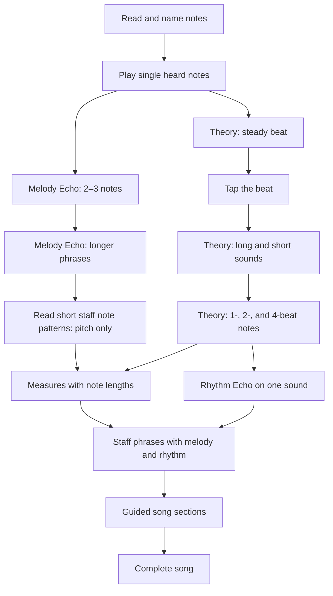

# Melody, Rhythm, and Song Learning Roadmap

## Purpose

Physical MIDI input makes performance learning possible, but MusicTeacher must not
assess concepts before introducing them. Melody memory must not implicitly become a
rhythm test before learners understand beat and duration.

This roadmap separates melodic and rhythmic development, then joins them for guided
songs.

## Learning principles

- Every assessed skill needs an earlier explanation or demonstration.
- Melody Echo initially evaluates pitch order only. Start time, gaps, held duration,
  overlap, and velocity are ignored.
- Rhythm begins independently using tapping and a single repeated sound, so pitch
  knowledge does not obscure the rhythmic lesson.
- MIDI and the on-screen keyboard remain equivalent input sources.
- A physical keyboard is recommended but never required.
- MIDI capability and its benefits must be obvious before practice begins, with a
  direct connection shortcut that remains available during practice.
- Newly unlocked activities remain optional and do not replace earlier practice.
- Songs are divided into short phrases so a late mistake does not erase a complete
  performance.
- Timing tolerances must be child-friendly and tighten gradually.

## Curriculum graph



The melody and rhythm branches advance independently. A full rhythmic song requires
both branches, while melody-only song phrases can unlock earlier.

## Release plan

### Release 1 — Melody Echo foundation

Goal: teach short pitch sequences without assessing rhythm.

- Add a source-neutral phrase model containing ordered MIDI note numbers.
- Add an evaluator tracking expected position, mistakes, and completion.
- Demonstrate phrases using existing note playback and key animation.
- Accept MIDI and on-screen piano input.
- Ignore note-off, velocity, timestamps, gaps, and held duration.
- Start with 2-note phrases and grow to 5 notes.
- Keep out-of-range notes neutral.
- Unlock Melody Echo after single-note aural play.

| Step | Pitch set | Phrase length | Rhythm |
|---|---|---:|---|
| Echo 1 | Three nearby white keys | 2 | Ignored |
| Echo 2 | Five nearby white keys | 3 | Ignored |
| Echo 3 | Current beginner range | 4 | Ignored |
| Echo 4 | Current beginner range | 5 | Ignored |

The target success rule is competency across recent phrases, such as 80% across the
last 10, rather than a perfect unbroken streak.

### Release 2 — Beat foundation

- Add theory explaining the musical heartbeat and tempo.
- Add beat tapping using touch, keyboard, or any MIDI note.
- Score broad pulse consistency without requiring a pitch.
- Visualize the next beat and show gentle early/late guidance.

### Release 3 — Duration foundation

- Teach one-, two-, and four-beat sounds with visual duration blocks.
- Introduce note-value symbols after the audible concept.
- Add press-and-hold exercises where note-off becomes meaningful.
- Teach rests after a steady beat.
- Add Rhythm Echo using one pitch or percussion.

Use beat counts as the primary language; conventional English and Dutch note-value
names can be secondary labels.

### Release 4 — Written-note bridge

- Show short note patterns on the staff instead of demonstrating them for imitation.
- First assess pitch order only; note lengths, start time, gaps, and tempo are ignored.
- Keep MIDI and the on-screen piano equivalent because the intended answer control is
  still a piano key, not staff placement.
- Add note-length requirements only after duration theory and held-sound practice.
- Add steady timing and rests only after Rhythm Echo.
- Treat staff reading, pitch performance, duration, and pulse as separate earned
  skills so later activities can require an explicit combination.

| Step | Staff notation | Pitch | Duration | Pulse/rests |
|---|---|---|---|---|
| Read 1 | 2–4 note pattern, no meter implied | Assessed | Ignored | Ignored |
| Read 2 | One 2/4 measure with two quarter notes | Assessed | Assessed | Ignored |
| Read 3 | One 4/4 measure with four quarter notes | Assessed | Assessed | Assessed |

Do not call Read 1 a measure: without assessed note values or a time signature, that
would imply rhythmic meaning the learner has not unlocked yet. Introduce the term
“measure” (`maat`) together with 2/4 in Read 2, then expand to 4/4 in Read 3.

### Release 5 — Guided songs

- Model songs as sections containing short phrases.
- Unlock the song path after the staff-read phrase prerequisites, rather than directly
  after Melody Echo.
- Offer full, partial, and no-hint variants.
- Unlock rhythmic variants only after rhythm prerequisites.
- Join phrases into sections, then into a complete song.
- Preserve phrase checkpoints and section practice.

## Repertoire strategy

Use original, game-like mini-songs as the core curriculum instead of relying on the
usual nursery-song repertoire. Original material lets every note, rhythm, range, and
unlock requirement serve the learning path while giving each song a playful identity.

| Working title | Role | Initial rhythmic vocabulary |
|---|---|---|
| Robot March | First 2/4 measure | Two quarter notes |
| Space Beacon | First 4/4 measure | Quarter and half notes |
| Sneaky Cat | First rests | Quarter notes and quarter rests |
| Dragon Wakes Up | Longer written melody | Quarter and half notes |
| Level Complete! | First joined song sections | Quarter, half, and whole notes |
| Pixel Chase | Eighth-note introduction | Paired eighth notes |
| Meteor Escape | Eighth-note consolidation | Repeated eighth-note patterns |
| Boss Battle | Later subdivision | Short sixteenth-note groups |
| Wizard's Spell | Much later triplet stage | Explicitly taught triplets |

Names and stories are working concepts, not final content. Each song should have a
small visual or narrative payoff so progression feels closer to unlocking a game
soundtrack than completing a worksheet.

An optional “Classics Remixed” path may later use verified public-domain compositions
with original MusicTeacher arrangements. Do not copy modern arrangements or
recordings merely because the underlying composition is public domain. Energetic
possibilities include *In the Hall of the Mountain King* and the *Can-Can*, but only
after their actual rhythmic and pitch requirements are unlocked.

### Rhythmic-vocabulary gate

Every song declares the notation and performance concepts it uses:

```text
meter: 4/4
uses:
  - quarter-notes
  - half-notes
  - quarter-rests
requires:
  - staff-phrase-pitch
  - duration-basic
```

Extend the vocabulary explicitly with concepts such as `paired-eighths`,
`eighth-rests`, `sixteenths`, `dotted-notes`, `ties`, `pickups`, `triplets`, and
`compound-meter`. Song validation and unlocking must reject content whose `uses`
entries are not covered by its declared prerequisites.

Triplets and compound meter are deliberately late concepts. Three notes in a motif
must not be labelled or performed as a triplet unless they divide one beat into three
equal parts. Likewise, 6/8 and shuffle-like material must not enter the early song
pool merely because its notation can be simplified visually.

### Future — Keyboard range discovery

After MIDI is connected and proven to receive notes, optionally ask the learner to:

1. Play the lowest physical key on the keyboard.
2. Play the highest physical key on the keyboard.

Store the resulting MIDI-note range as a device-specific preference. Use it to:

- Choose phrases that fit comfortably on the connected keyboard.
- Avoid teaching examples that require unavailable physical keys.
- Explain when an exercise needs the controller's octave-shift buttons.
- Size or position the on-screen keyboard around the learner's instrument.
- Distinguish notes outside the exercise range from notes outside the known keyboard
  range.

Calibration must remain optional and repeatable. It must not permanently restrict
input, because octave-shift buttons can change the MIDI notes produced by the same
physical keys after calibration. If a learner later plays outside the stored range,
accept the input and offer to update the detected range.

The flow should verify that the second note is higher than the first and show both
scientific names and the detected span, for example:

```text
Lowest: C2
Highest: C7
Detected range: 5 octaves
```

Persist the range by MIDI device identifier, not globally, because learners may use
different controllers on the same device.

## Target content model

```text
Song
  id, title, prerequisites
  sections[]
    id, title
    phrases[]
      midiNotes[]
      beatDurations[]?   # absent for melody-only content
      tempoBpm?          # absent until rhythm is assessed
      hintMode
```

Missing duration and tempo data means timing is not assessed; it must not imply
default quarter notes.

## Unlock architecture

The current implementation uses a linear `DrillMode` chain and best-streak thresholds.
Before Release 2, introduce explicit skills and prerequisites:

```text
note-reading
staff-placement
single-note-ear-play
melody-echo-short
melody-echo-long
staff-phrase-pitch
steady-beat
duration-basic
rhythm-echo
staff-phrase-duration
staff-phrase-timed
guided-song-melody
guided-song-rhythm
```

Activities unlock when all prerequisite skill requirements are met. Theory pages
should declare prerequisites instead of inferring availability from a drill enum.

## Verification gates

### Melody Echo

- Correct notes advance exactly one position.
- Incorrect notes do not advance or reset the phrase.
- Completion requires the full ordered sequence.
- Timing, velocity, and note-off never affect Release 1 scoring.
- MIDI and on-screen input produce identical evaluation.
- Staff-placement exercises remain unaffected.

### Rhythm and songs

- Rhythm assessment remains locked until beat and duration theory is available.
- Melody-only phrases never fail because of timing.
- Timing tolerances are tested at exact boundaries.
- Song progress persists per phrase and section.
- Old saved progress remains readable as progress evolves.

## Implementation status

- [x] Curriculum and staged release plan documented.
- [x] Release 1 phrase model and evaluator.
- [x] Release 1 evaluator unit tests.
- [x] Melody Echo activity UI and playback.
- [x] Melody Echo unlock and progress persistence.
- [x] Longer four- and five-note Melody Echo level.
- [x] Steady-beat theory unlocked after single-note aural play.
- [x] Beat tapping with touch, Space, and pitch-neutral MIDI input.
- [x] Long-versus-short sound theory using beat-count visuals.
- [x] Audible one-, two-, and four-beat duration theory.
- [x] Quarter-, half-, and whole-note symbols introduced after beat counts.
- [x] Pitch-neutral press-and-hold exercise with count-in and metronome guidance using pointer, Space, or MIDI note-off.
- [x] Rest theory showing that the steady beat continues through silence.
- [x] Four-beat Rhythm Echo foundation using one-beat sounds and rests.
- [x] Explicit skill/prerequisite unlock model for current activities and theory.
- [x] Staff-read pitch phrases with timing ignored.
- [x] First 2/4 measure with two pitch-and-duration-assessed quarter notes.
- [x] 4/4 written measure and continuous timing layer.
- [x] Reusable song/section/measure content model and persistent pitch-rehearsal checkpoints.
- [x] Timed song-measure rehearsal with persistent checkpoints.
- [ ] Joined section progression and complete-song performance.
